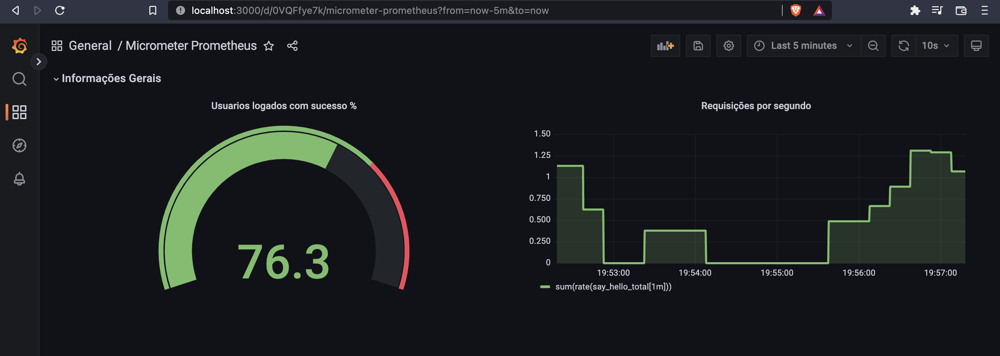

# APP METRICAS
Projeto de estudos da integração do Spring Boot e o Prometheus.
## Requisitos

* Docker
* Java 11
* Make (Opcional mas facilita)

## Como executar?  

Primeiramente renomeie o arquivo prometheus.sample.yml para prometheus.yml e em seguida substitua em target a string "SEU IP" pelo ip da sua maquina, Em seguida rode o comando `make dependencies`, onde será iniciado o container do Prometheus 
e um container do Grafana.
Em seguida rode um projeto na sua IDE.

## Metricas
Há dois tipos de metrica nessa aplicação.
* Counter ou Contador sempre incremental. ex.: Numero de requisições
* Gauge ou Gausiana, valor instantaneo de determinado valor, podendo variar livremente. ex.: Porcentagens de erro.

## Como testar?

Para testar um Count:  
com seu projeto  rodando acesse http://localhost:8080/true ou http://localhost:8080/false para gerar metricas

Para testar um Gauge:  
Com o seu projeto rodando acesse http://localhost:8080/usuariosLogados para que seja gerado 
um valor aleatorio para a metrica gausiana.

Após criadas as métricas é possivel organizalas por meio de dashboard e paineis no grafana
para isso acesse http://localhost:3000 e entre com usuario e senha padrões do grafana `usuario = admin` e `senha = admin`
em seguida conecte o datasource Prometheus e em url coloque `"SEU_IP":9090` em seguida exporte o dashboard `assets/Micrometer Prometheus.json` você deve visualizar um dashboard semelhante a imagem:  

